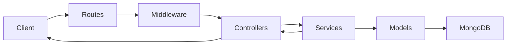

## Modular Backend Boilerplate

Production-ready Node.js/Express/MongoDB backend scaffold with feature-first modules, JWT auth, reusable CRUD factories, validation, logging, health diagnostics, and file upload support.

## Tech Stack

- Node.js (CommonJS)
- Express 5
- MongoDB + Mongoose
- JWT auth with `jsonwebtoken`
- Password hashing with `bcryptjs`
- Request/data validation with `joi`
- Upload handling with `multer`
- Environment config with `dotenv`

## Architecture

All APIs are mounted under ` /api/v1 `.



### Key design choices

- Feature modules under `src/modules/*` for bounded contexts.
- Shared reusable CRUD route/controller/service factories.
- Global middleware for request logging, error handling, and auth.
- Central env configuration through `src/config/env.js`.

## Project Structure

```text
src/
  config/
    app.js
    db.js
    env.js
    multer.js
  controllers/
    crud.controller.js
    upload.controller.js
  middleware/
    auth.js
    validate.js
    requestLogger.js
    errorHandler.js
    notFound.js
  models/
    user.model.js
    item.model.js
    product.model.js
    order.model.js
    ticket.model.js
    post.model.js
    comment.model.js
  modules/
    auth/
    users/
    items/
    products/
    orders/
    tickets/
    blog/
  routes/
    index.js
    crud.routes.js
    health.routes.js
    upload.routes.js
    admin.routes.js
  services/
    crud.service.js
  utils/
    ApiError.js
    asyncHandler.js
    logger.js
  validation/
    common.validation.js
    auth.validation.js
    user.validation.js
    item.validation.js
    product.validation.js
    order.validation.js
    ticket.validation.js
    blog.validation.js
```

## Setup

1. Install dependencies:
   - `npm install`
2. Create env file:
   - Copy `.env.example` to `.env`
3. Fill required values:
   - `MONGO_URI`
   - `JWT_SECRET`
4. Start development server:
   - `npm run dev`
5. (Optional) Seed initial data:
   - `npm run seed`
   - `npm run seed:reset` (wipes and reseeds)

## Environment Variables

- `PORT` - HTTP port (default `5000`)
- `NODE_ENV` - environment (`development`/`production`)
- `LOG_LEVEL` - logger level (`error`, `warn`, `info`, `debug`)
- `MONGO_URI` - MongoDB connection string
- `JWT_SECRET` - signing secret for access tokens
- `JWT_EXPIRES_IN` - token TTL (example: `1h`)
- `JWT_REFRESH_EXPIRES_IN` - refresh token TTL (example: `7d`)
- `RATE_LIMIT_WINDOW_MS` - rate limiter window (default 15 minutes)
- `RATE_LIMIT_MAX` - max API requests per window
- `AUTH_RATE_LIMIT_MAX` - max auth requests per window

## API Overview

### Health and diagnostics

- `GET /api/v1/health` - service status, DB state, uptime, environment
- `GET /api/v1/admin/diagnostics` - protected admin diagnostics (collection counts)

### Authentication

- `POST /api/v1/auth/register`
- `POST /api/v1/auth/login`
- `POST /api/v1/auth/refresh`
- `POST /api/v1/auth/logout`
- `GET /api/v1/auth/me` (requires Bearer token)
- `GET /api/v1/docs` - Swagger UI

### Upload

- `POST /api/v1/upload/single` (field: `file`)
- `POST /api/v1/upload/multiple` (field: `files`)

### CRUD resources

All are RESTful CRUD endpoints:

- `items` - `/api/v1/items`
- `users` - `/api/v1/users` (admin protected)
- `products` - `/api/v1/products` (public read, admin write)
- `orders` - `/api/v1/orders` (owner/admin access control)
- `tickets` - `/api/v1/tickets` (owner/admin access control)
- `blog posts` - `/api/v1/blog/posts` (public read, owner/admin write)
- `blog comments` - `/api/v1/blog/comments` (public read, owner/admin write)

## Querying and Pagination

List endpoints support:

- `page`, `limit`, `sort`
- `search` (matches common text fields)
- `fields` (comma-separated projection)
- `populate` (comma-separated relations)
- dynamic filters (example: `status=pending`)
- range filters (example: `priceMin=10&priceMax=100`)
- pattern filters (example: `nameLike=phone`)

Response format:

```json
{
  "data": [],
  "total": 0,
  "page": 1,
  "limit": 20
}
```

## Functional Requirements (FR)

1. The system must expose versioned API endpoints under `/api/v1`.
2. The system must support user registration and login via email/password.
3. The system must issue and validate JWT access tokens.
4. The system must support role-based authorization (`user`, `admin`).
5. The system must provide reusable CRUD capabilities for domain entities.
6. The system must support modules for users, items, products, orders, tickets, blog posts, and comments.
7. The system must validate request payloads/params/query and reject invalid requests with `400`.
8. The system must support file uploads (single and multiple) with MIME/size limits.
9. The system must expose health status including DB connectivity and uptime.
10. The system must provide admin diagnostics endpoint for high-level collection metrics.
11. The system must support filtering, sorting, pagination, projection, and population in list APIs.
12. The system must return standardized JSON error responses through centralized error middleware.

## Non-Functional Requirements (NFR)

### Security

- Passwords must be stored as hashes, never plain text.
- Protected routes must require valid JWT Bearer tokens.
- Authorization must enforce role checks where required.
- Input validation must sanitize/strip unknown fields.

### Performance

- List endpoints must support pagination to limit payload size.
- Query layer must support targeted filters and projections to reduce DB load.
- Service should be designed to allow future caching integration.

### Reliability

- App startup must fail fast when required env vars are missing.
- Centralized error handling must avoid uncaught route-level promise failures.
- Health endpoint must expose service and dependency status.

### Observability

- Request logs must include method, path, status, latency, and user context when available.
- Error logs must include stack traces outside production.

### Maintainability and Modularity

- New features must be implemented as module folders under `src/modules`.
- Shared concerns must stay in dedicated layers (`config`, `middleware`, `utils`, `validation`).
- CRUD factories must be reused for consistent behavior across resources.

### Extensibility

- New models/modules should be pluggable with minimal boilerplate.
- Validation schemas must remain isolated per domain to simplify evolution.
- API versioning (`/api/v1`) must support future non-breaking expansion.

## Production Hardening Notes

- Sensitive fields such as `passwordHash` are sanitized from CRUD and auth responses.
- User admin CRUD accepts `password` input and hashes it server-side before persisting.
- Access + refresh JWT pair with refresh token rotation and revocation persistence.
- Revoked access tokens are denied on authenticated endpoints.
- RBAC is enforced per operation using route-level middlewares:
  - `items`/`products`: public read, admin write/delete.
  - `orders`/`tickets`: authenticated, owner-or-admin read/update/delete, owner auto-assigned on create.
  - `blog posts/comments`: public read, authenticated create, owner-or-admin update/delete.
- Security middlewares include `helmet`, `compression`, and global/auth-specific rate limiting.
- Every request includes correlation ID support via `x-correlation-id`.
- Non-read operations produce audit log entries with sensitive fields redacted.
- Admin diagnostics endpoint remains role-protected at `/api/v1/admin/diagnostics`.
- Seed script creates/updates admin user and baseline test data for fast onboarding.

## DevOps and Delivery

- Docker:
  - Build and run with `docker compose up --build`
  - Services included: `app`, `mongo`, `redis`
- CI:
  - GitHub Actions workflow at `.github/workflows/ci.yml`
  - Runs lint (`npm run lint`), tests (`npm run test`), and security scan (`npm audit --audit-level=high`)

## Quick Usage Examples

Register:

```bash
curl -X POST http://localhost:5000/api/v1/auth/register \
  -H "Content-Type: application/json" \
  -d "{\"email\":\"admin@example.com\",\"password\":\"secret123\",\"name\":\"Admin User\"}"
```

Login:

```bash
curl -X POST http://localhost:5000/api/v1/auth/login \
  -H "Content-Type: application/json" \
  -d "{\"email\":\"admin@example.com\",\"password\":\"secret123\"}"
```

Paginated products:

```bash
curl "http://localhost:5000/api/v1/products?page=1&limit=10&priceMin=100&priceMax=500" \
  -H "Authorization: Bearer <TOKEN>"
```
